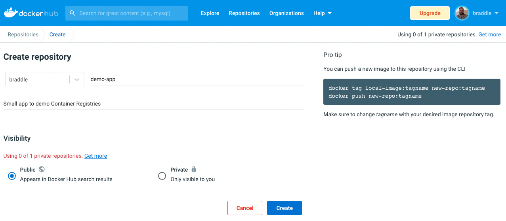

# Deploy a Spring Web App inside a container

## Prerequisites
1. Install [Docker](https://docs.docker.com/desktop/install/mac-install/) 
2. Install [Docker Compose](https://docs.docker.com/compose/install/)  
3. Create an account on [Docker Hub](https://hub.docker.com/signup) _Just a free account_
4. Login on Docker Desktop to your Docker Hub account

## Activity

### Setup
I have included a very simple web app in the directory that launches a web server on port 8080 and displays a hello 
world message.  
You can launch this server by performing following:
- `./mvnw package && java -jar target/containerDemo-0.0.1-SNAPSHOT.jar`  
- Then go to localhost:8080 to see your “Hello Docker World” message.

### Containerise It
Docker has a simple "Dockerfile" file format that it uses to specify the “layers” of an image.  
Create the following Dockerfile in your Spring Boot project:

```dockerfile
FROM openjdk:19-jdk
ARG JAR_FILE=target/containerDemo-0.0.1-SNAPSHOT.jar
COPY ${JAR_FILE} app.jar
ENTRYPOINT ["java","-jar","/app.jar"]
```

### What does this mean?
**FROM** - This instruction sets the Base Image for subsequent instructions. As such, a valid Dockerfile must start with 
a FROM instruction. The image can be any valid image – it is especially easy to start by pulling an image from the 
Public Repositories.  

**ARG** - The ARG instruction defines a variable that users can pass at build-time to the builder with the docker build 
command using the --build-arg <varname>=<value> flag or it can be set in the Dockerfile like we are doing. If a user 
specifies a build argument that was not defined in the Dockerfile, the build outputs a warning. A Dockerfile may include 
one or more ARG instructions.   

**COPY** - The COPY instruction copies new files or directories from <src> and adds them to the filesystem of the 
container at the path <dest>. Multiple <src> resources may be specified but the paths of files and directories will be 
interpreted as relative to the source of the context of the build.

**ENTRYPOINT** - An ENTRYPOINT allows you to configure a container that will run as an executable. Once the container is 
created this is the command that will run.

You can build the image from the Dockerfile with the following command:

### Building the image

```shell
docker build -t {docker_hub_username}/demo-app .
```

This command builds an image and tags it as `{docker_hub_username}/demo-app`. The fullstop at the end is just specifying 
the directory where the Dockerfile is located relative to where the command has been run. In our case we use the full 
stop to represent the current directory.  

This Dockerfile is very simple, but it is all you need to run a Spring Boot app with no frills: just Java and a JAR 
file. The build creates a spring user and a spring group to run the application. It is then copied (by the COPY command) 
the project JAR file into the container as app.jar, which is run in the ENTRYPOINT. The array form of the Dockerfile 
ENTRYPOINT is used so that there is no shell wrapping the Java process.  

### Running the container

You can then run the container using:

```shell
docker run -p 8080:8080 {docker_hub_username}/demo-app
```

Congratulations! You have [run a Docker container for a Spring Boot application](http://localhost:8080/)! By default, 
Spring Boot applications run on port 8080 inside the container, and we mapped that to the same port on the host by using 
-p on the command line.

To stop the application running you can hit `ctrl-c`

using docker run in this way leave you with a terminal window that is blocked showing the logs of the running 
application. Sometimes you may want to have your application running in the background for this you can use the detached
mode using the following command

```shell
docker run -d --name my-demo -p 8080:8080 {docker_hub_username}/demo-app
```

If you want to see what container are running you can use `docker ps` this will list all running containers. The output
should look something like this

```
CONTAINER ID   IMAGE              COMMAND                CREATED          STATUS          PORTS                    NAMES
39f56f4c0185   braddle/demo-app   "java -jar /app.jar"   50 seconds ago   Up 49 seconds   0.0.0.0:8080->8080/tcp   my-demo
```

The container is now running in the background enabling you to continue working in that terminal window. You can still 
view the logs of the application if you need to by using the `logs` command

```shell
docker logs my-demo
```

you can stop the container running using the `stop` or `kill` commands:

```shell
docker stop my-demo
```

```shell
docker kill my-demo
```

once it has stopped you can remove the container by using `docker rm my-demo`

### Pushing to Container Repository (Docker Hub)

Once you have a Docker container you will want to push it somewhere to make it accessible to deploy to testing and 
production environments. Usually this would be part of your CI/CD pipeline, but today we are going to do it manaully on 
our own laptops.


Login to docker hub and [create](https://hub.docker.com/repository/create) a new public repository call `demo-app`



When you use the `docker build` command that will create a store a new version of the container tagged as `latest` this
is similar to committing changes on git but not pushing them to the remote repository. You could just push the `latest`
to the Container Registry but that is not best practise so first of all we will create a tag of the current latest image 
using [Semantic Versioning](https://semver.org/).

```shell
docker tag {docker_hub_username}/demo-app:latest {docker_hub_username}/demo-app:1.0.0
```

You can see a list of the images and tags using the following command:

```shell
docker image ls
```

The output should look like this

```
REPOSITORY                    TAG       IMAGE ID       CREATED          SIZE
braddle/demo-app              1.0.0     d6f5e22210a3   13 seconds ago   513MB
braddle/demo-app              latest    d6f5e22210a3   13 seconds ago   513MB
openjdk                       19-jdk    fafed7e8bf17   8 days ago       496MB
```

We now want to push the latest and the 1.0.0 tagged builds to Container Repository (Docker Hub). We push both the latest 
and the tag to enable us to pull down either the latest build or a specific tag allowing us to make a descision of when 
we upgrade. We can do this by running the following two commands:

```shell
docker push {docker_hub_username}/demo-app:latest
docker push {docker_hub_username}/demo-app:1.0.0
```

Checkout the containers on in you Repository: https://hub.docker.com/repository/docker/{docker_hub_username}/demo-app

You should see a page similar to this


