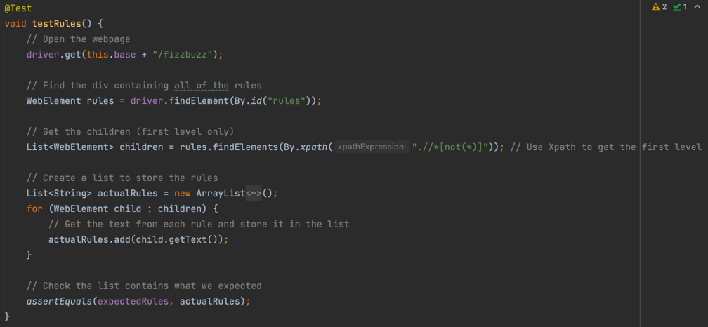

# Automated Testing with Selenium

## Goal

We are going to use Selenium to perform automated testing on a webapp.

## Setup

- Ensure you have **openjdk 16+** installed
- Open a terminal and navigate into the **002-AutomatedTesting** directory: `cd 002-AutomatedTesting`
- Run `./mvnw clean install` to install the dependencies
- Run the application `./mvnw spring-boot:run`
- Ensure you can visit the application in the browser `http://localhost:8080/fizzbuzz`
- Play around, understand what it should
- Open the FizzBuzzSeleniumTests class and start implementing the tests!
- Once you have written a test you can run the test class or specific test by pressing the green buttons
  shown on the left below.

  
- Or run all tests with `./mvnw test`

## How do the tests work?

### Class set up

We are performing E2E tests which mean that we need the application actually running whilst the tests are being
executed. To do this we look at the code below.

  
The @SpringBootTest annotation takes in the name of our application class that runs the server. This then ensures that
when a test case is run, the server is launched beforehand.  
You will also see that @SpringBootTest takes in another argument of webEnvironment. We use this to set a random port
that the server uses, this port is then injected using the @LocalServerPort annotation for use in the tests.

### Test set up

As you can see we have three annotations used below.

- @BeforeAll
    - This annotation ensures that the method below it runs before any test is executed. It runs only once and at the
      very start of the test.
    - In this case it is used to set up the Chrome driver. This driver is then used to control the Chrome browser when
      the tests are run.
- @BeforeEach
    - This annotation ensure that the method below it runs once *before each* test. Unlike BeforeAll which only runs
      once regardless of the number of tests you are running.
    - It is used to create a new instance of the ChromeDriver and set the base url to our localserver and whatever port
      has been chosen.
- @AfterEach
    - This annotation ensure that the method below it runs once *after each* test.
    - It is used to close down the browser and end the session. It is good practice to do this between tests as you cna
      then ensure that the next test will not be tainted by any previous runs.

Here is a complete list of other annotations: https://www.guru99.com/junit-annotations-api.html

### Tests

In the first test we are checking if the title is correct.

1. In this test we start by navigating to the webpage.
2. We then call getTitle() on the driver to pull the title string from the webpage.
3. Finally, we assert whether this is correct

In the next test we are trying to check if all the rules on the webpage are correct.

1. In this test we start by navigating to the webpage.
2. We then find the element in the page which has the id 'rules'
3. This then returns an element that has 8 divs, 4 parents and 4 children.
   Note: You can open up the inspector in your browser to better understand the structure of the webpage and how to
   traverse it with
   selenium. https://endtest.io/guides/blog/2020/07/31/a-practical-guide-for-finding-elements-with-selenium/

   
4. We then perform another find action on the 'rules' web element to get only 1 level of divs. This step may look like
   gibberish, but it's using Xpath, when you are viewing the source code in the inspector of your browser you can right-
   click the code > copy > as xpath. So you will rarely need to figure it out yourself.
5. We then call getText on the 4 children elements that we have found and add them to the list.
6. Finally, we assert that the rules are inline with what we were expecting.

## Activity

### Sprint 1

You have just delivered the FizzBuzz webapp. The number of E2E tests are lacking and the product owner would like them
to be expanded.

> #### SEL-FEAT-394
> As a product owner, I want all the fizzbuzz test cases implemented in the E2E tests, so that I can have a
> regression suite.
> #### Acceptance Criteria
>- [ ] Invalid input is tested
>- [ ] Multiples of 3 are tested
>- [ ] Multiples of 5 are tested
>- [ ] Multiples of both 3 and 5 are tested

### Sprint 2

Since you successfully delivered the E2E tests in the last sprint, new development on the application has become much
safer as the suite of tests are able to verify there hasn't been any breaking changes.

The product owner has now asked for extra functionality that allows a user to generate the sequence for the first 100
numbers.

> #### SEL-FEAT-049
> As a product owner, I want the user to be able to generate the FizzBuzz sequence for the first 100 numbers.
> #### Acceptance Criteria
>- [ ] A button named 'Generate' populates the screen with the first 100 terms of the fizzbuzz sequence
>- [ ] The new functionality has E2E tests.

## Further help

How to find elements on the page: https://www.guru99.com/find-element-selenium.html
How to interact with elements: https://www.guru99.com/accessing-forms-in-webdriver.html
