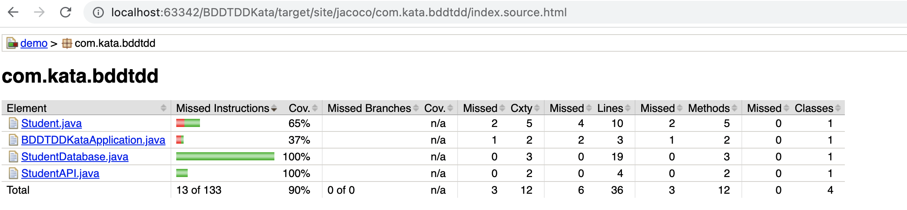

# BDD

## Application

Currently, we need to expose a GET endpoint that allows the client to search for students whose nameprefix matches the requested string.

Example request and response:
```shell
Request:
http://localhost:8080/search/a

Response:
[{"firstName":"abhishek","lastName":"rajput"},{"firstName":"ash","lastName":"ketchum"}]
```

## Setup

- Ensure you have **openjdk 16+** installed
- Open a terminal and navigate into the **003-BDD** directory: `cd 003-BDD`
- Run `./mvnw clean install` to install the dependencies
- Run the application `./mvnw spring-boot:run`
- Ensure you can visit the application in the browser `http://localhost:8080/search/a`
- You should see two results with first names that begin with 'a'.

## How do the tests work?

### CucumberIntegration set up

We have created a CucumberIntegration.java class in the test directory as below:
```java
@RunWith(Cucumber.class)
@CucumberContextConfiguration
@SpringBootTest(
        classes = BDDTDDKataApplication.class,
        webEnvironment = SpringBootTest.WebEnvironment.DEFINED_PORT)
@CucumberOptions(features = "src/test/resources", plugin = {"pretty",
        "html:build/reports/cucumber/cucumber-report.html"})
public class CucumberIntegration {
}
```  
This enables us to run our Cucumber tests with JUnit. We can see the annotation @CucumberOptions where we're specifying the location of the Gherkin file which is also known as the feature file. At this point, Cucumber recognises the Gherkin language

### Add features and Spring-Cucumber Integration
We can now create a resource subdirectory inside the test directory as `src/test/resources` and add a feature file as we have below:

```gherkin
  Scenario: When a name prefix is passed all the students information starting with that is returned
    Given Student enters name prefix "n"
    When The student makes a call to "http://localhost:8080/search/" and get the details
    Then The API should return the student details and response code 200
```

We now need to link the scenario steps to actual code. We created another class called StepDefinition.java and added the below step definitions which are code implementation of the feature that we have added.
Our BDD test requirement is to call an GET API to retrieve student details with a given name prefix and assert that.

```java
package com.kata.bddtdd;

import io.cucumber.java.en.Given;
import io.cucumber.java.en.Then;
import io.cucumber.java.en.When;
import org.springframework.http.ResponseEntity;
import org.springframework.web.client.RestTemplate;

import java.util.List;

import static org.junit.jupiter.api.Assertions.assertEquals;

public class StepDefinition {

    String namePrefix = null;
    private ResponseEntity response;
    RestTemplate restTemplate = new RestTemplate();

    @Given("Student enters name prefix {string}")
    public void student_enters_the_roll_number(String namePrefix) {
        this.namePrefix = namePrefix;
    }

    @When("The student makes a call to get the details")
    public void the_student_makes_a_call_to_get_the_details() {
        response = restTemplate.getForEntity("http://localhost:8080/search/" + this.namePrefix, List.class);
    }

    @Then("The API should return the student details and response code {int}")
    public void the_api_should_return_the_student_details_and_name_as(int statusCode) {
        assertEquals(statusCode, response.getStatusCodeValue());
    }
}
```

### Testing the application
From your terminal execute below command to run the tests.

```bash
./mvnw test
```

Expected output:
```bash
[INFO] Results:
[INFO] 
[INFO] Tests run: 4, Failures: 0, Errors: 0, Skipped: 0
```

# Katas

Once you understand how the application works. You are ready to start with the katas.

The rule of doing these katas are:

- You should pair or mob while working on these katas.
- Fork this repository so that you have working copy of yours and ensure each member of the group has write access to it.
- Practise BDD and TDD
- Follow coding best practices
- Add, refactor or delete tests accordingly and make sure all the tests are passing. 
- You are free to search and refer other codebase, but you should be able to justify the implementation.

## 1. Updating the current application

As part of the kata we would like you to either implement a feature or refactor code.

### 1.1 Implement Separation of concern

Purposefully the application is coded in a way that it omits the separation of concern principle. Refactor the code accordingly to meet coding best practices.

Acceptance Criteria:
- Ensure all tests (Unit & BDD) are still passing once the refactoring is done.
- Ensure all classes and packages are named appropriately.

### 1.2 Change the port and application URL

At the moment the API is accessible at `http://localhost:8080/search/{namePrefix}`.

Requirements:
- The application should use Spring Boots concept of <b>context path</b> before all the api requests. The content path should be 'student'.
- The application is accessible on port 9090.

Acceptance Criteria:
- When the client invokes below API.
```shell
http://localhost:9090/student/search/n
```
Expected Response:
```json
[{"firstName":"novita","lastName":"s"}]
```
- Ensure all tests (Unit & BDD) are passing.

### Hint: Learn how to ser the port and context path in the application.properties or application.yaml

### 1.3 Make the api case-insensitive

Requirements:
- The API should be case-insensitive

Acceptance Criteria:
- When the student invokes below API with name prefix as 'n' or 'N' the response should be the same.
```shell
http://localhost:9090/student/search/n

http://localhost:9090/student/search/N
```

Expected Response:
```json
[{"firstName":"novita","lastName":"s"}]
```

### 1.4 Build a new feature where the student can search for details with there exact last name.
Requirements:
- Use below scenario to implement the new feature
```gherkin
  Scenario: When a student want to search student details by last name and the api is case insensitive
    Given Student enters last name "RaJpUt"
    When The student makes a call to "http://localhost:9090/student/searchbylastname/" and get the details
    Then The API should return the student details where firstname is "abhishek", lastname is "rajput"
    And response code 200
```

Acceptance criteria:
- You should have followed BDD first approach.
- All tests are passing.
- When the student invokes below API with last name as 'RaJpUt'
```shell
http://localhost:9090/student/searchbylastname/RaJpUt

or

http://localhost:9090/student/searchbylastname/rajput
```

Expected Response:
```json
[{"firstName":"abhishek","lastName":"rajput"}]
```

### 1.5 When no data found for a given name prefix.

Requirements:
- Use below scenario to implement the new feature
```gherkin
    Scenario: When a name prefix is passed but no data is matched
      Given Student enters name prefix "Z"
      When The student makes a call to "http://localhost:9090/student/search/" and get the details
      Then The API should return a message "no student data found" and response code 404
```

### 1.6 When invalid input data is passed as name prefix

Requirements:
- When name non-alphabetic name prefix is passed the application should return error status code as 400 and message bad request.
- Use below scenarios to implement the new functionality
```gherkin
    Scenario: When a non alphabetic name prefix is passed
      Given Student enters name prefix "11111111"
      When The student makes a call to "http://localhost:9090/student/search/" and get the details
      Then The API should return a message "bad request a name prefix can only contain alphabets" and response code 400
```

```gherkin
  Scenario: When a name prefix is passed but no data is matched
    Given Student enters name prefix "@bhishek"
    When The student makes a call to "http://localhost:9090/student/search/" to get the details
    Then The API should return a message "bad request" and response code 400
```

<b>Implementation of [Kata 1 can be found in kata1 branch](https://github.com/abhisheksr01/bdd-tdd-kata/tree/kata1) of this repository.</b>

### Bonus
To check the test code coverage execute tests with the install command:

```shell
./mvnw clean install
``` 

The JaCoCo test code coverage should be available at below path.
```shell
target/site/jacoco/index.html
```

