# Version Control - GitHub

## Setup

- Have Git installed on your machine
- A GitHub account

## Activity

This is a short exercise to get you used to using Git to perform simple operation such as: cloning, staging, commiting,
pushing, Pull/Merge Requests and rebasing.

### Creating a new Repository

Locate the + button to create new things at the top right of the screen and click New Repository

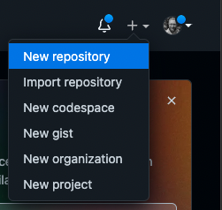

Create a new repository call `git-practice`, add a README and Licence.

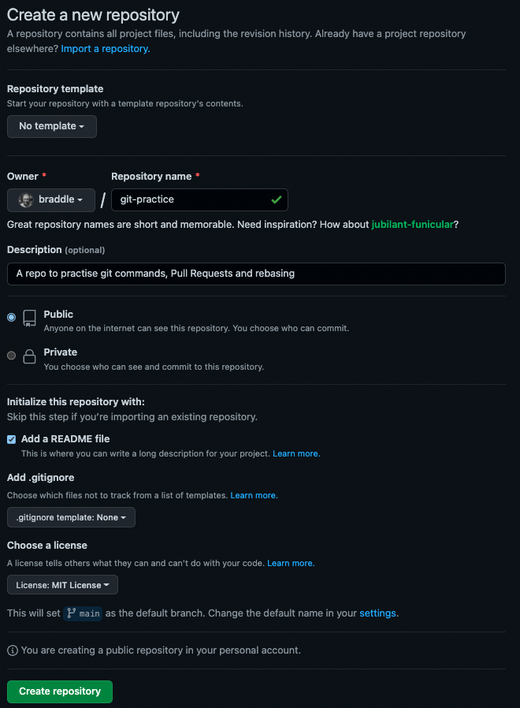

Once you have created your repository it should look something like this.


### Cloning the Repository

To edit the code in our repository we need to **clone** it. `git clone` create a directory for the code and downloads 
the code from the repository into the new directory. We will now **clone** our new repository.

```shell
git clone git@github.com:{YOUR_GITHUB_USERNAME}/git-practice.git
```

You should see something like this


If you move into the newly create directory and check its status. The `git status` command show the current state of 
working tree. Showing files that have been added, modified and deleted.

```shell
cd git-practice
git status
```


### Editing an existing file

Open README.md in you IDE and add some new content the file under the existing content. For example:

```markdown
### About Me

**Name**: Mark Bradley
**Location**: London
**Languages**:
  - PHP
  - Java
  - Golang
```

If you check the status of for local repository

```shell
git status
```

you should have one changed file where the changes have not yet been staged.

If you were to commit at this point nothing would be committed because no of the changes have been staged.

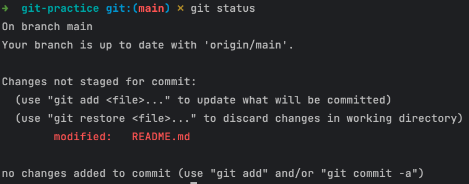

you can see what has been changed by checking the **diff**. It shows all the lines of code we added to our README

```shell
git diff
```


If we want to commit the change and push it back to GitHub we first have to stage the change using the **add** command
there are few ways we can do this.

The first will stage all un-staged changes 

```shell
git add .
```

This will stage a specific file

```shell
git add README.md
```

or you can check the patch and stage just the change parts you want

```shell
git add -p
```

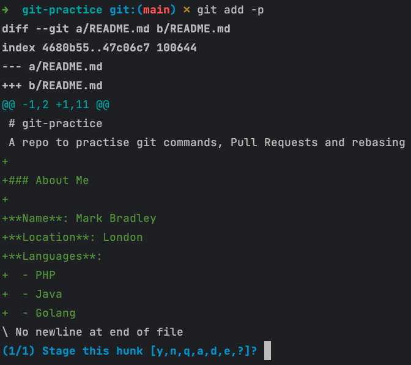

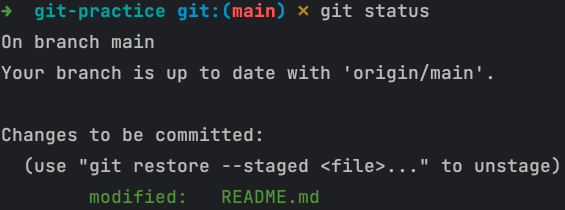

Now that our change has been stage we can commit our change. we can provide a commit message using the message flag`-m` 

```shell
git commit -m "A short message about our change"
```

or if you leave off the message flag and git will open a text editor for you to add a message the advantage of this way 
is that you can add a multi-line message.

```shell
git commit
```

I recommend you read this [article](https://cloudnative.ly/what-does-a-good-commit-message-look-like-89ba44e364e0) on
What does a good commit message look like.

once you have commited your changes we can now push them up to GitHub

```shell
git push origin main
```

if you remove some of the lines you added to the README and check the diff you can see how git show changes where code 
is removed from a file


we are not going to keep these changes so we will use the **restore** command to remove the changes we have just made

```shell
git restore README.md
```

### Creating a branch

Sometimes the feature we are working on is going to take a couple of days and we want to commit our changes. We can do 
this using a branch

Branches are TODO

we can create a branch using the **checkout** command using the branch flag `-b`

```shell
git checkout -b add_hobbies
```

edit the README file again to add some hobbie to the bottom of you file something like

```markdown
**Hobbies**:
  - Photography
  - Teaching TDD
  - Cooking
  - Collection CDs
```

Add and commit these changes, but do not push them yet. While we were looking at the file we notice we made some 
mistakes in the MarkDown format and have missed some line breaks. Edit you README so it now look similar to this:

```markdown
### About Me

**Name**: Mark Bradley

**Location**: London

**Languages**:
  - PHP
  - Java
  - Golang

**Hobbies**:
  - Photography
  - Teaching TDD
  - Cooking
  - Collection CDs
```

Add and Commit these changes then push to you new branch

```shell
git push origin add_hobbies  
```

When we push the changes to GitHub it should show a link for us to create a Pull Request. Click this link to create the 
Pull Request.

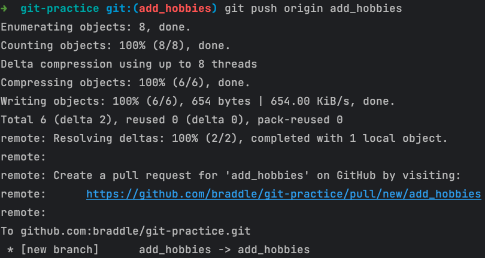

If the link does not appear when you push you will also see the suggestion to create a Pull Request at the top of the 
repository page on GitHub.


Create the Pull request. Give it a title and description that will be meaningful to who ever reviews it. It is common to 
include the ticket number in the title, Many of the task management tools (Jira, Trello, Pivotal Tracker) have 
integration in to GitHub that will link the Pull Request to the ticket.

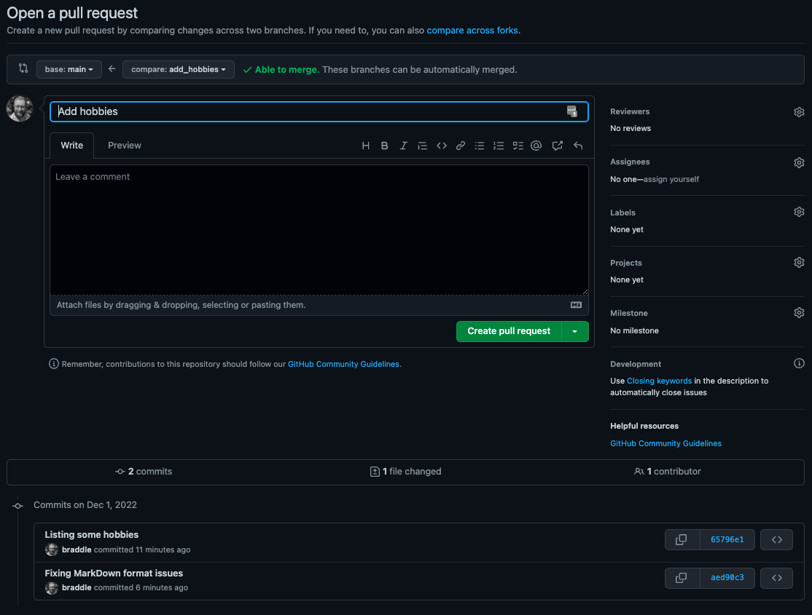

At this point the Pull Request is merge-able, but do not merge it just. We will come back to merge it later 


### Creating Conflict

When we work on code most of the time we work in teams. Although we are usually working on different features for our 
application, it is likely that we may edit code in the same file and possible there same area of this file. When this 
happens Git is unable to work out how to combine the two changes. These conflict must be resolved manually using a 
feature of Git called **Rebasing**.

First we need to move back to working on the main branch. If you don't use the branch flag `-b` you can move to an 
existing branch. 

```shell
git checkout main
```

By using the **branch** command you can see what branches are available 

Using the **branch** command with no flags it will like all local branches

```shell
git branch
```

if you want to see what remote branches are available you can use the remotes flag `-r`

```shell
git branch -r
```

To create some conflicting changes we are going to add some content to our README

First off we need to fix the markdown format issues. Your markdown should look something like this

````markdown
### About Me

**Name**: Mark Bradley

**Location**: London

**Languages**:
  - PHP
  - Java
  - Golang
````

Commit this change. Then add a hobbies section between the Location and Language sections.

```markdown
**Hobbies**:
  - Reading
  - Colouring In
  - Watching Films
  - Listening to Music
```

Your README file should look something like this. Commit these changes

````markdown
### About Me

**Name**: Mark Bradley

**Location**: London

**Hobbies**:
  - Reading
  - Colouring In
  - Watching Films
  - Listening to Music

**Languages**:
  - PHP
  - Java
  - Golang
````

The final change we are going to make is to add a favourite films section to our README file underneath the Languages
section

```markdown
**Films**:
  - Hackers
  - The Matrix
  - The Net
  - War Games
```

Your README file should look something like this. Commit these changes and push all the changes to the origin main

````markdown
### About Me

**Name**: Mark Bradley

**Location**: London

**Hobbies**:
  - Reading
  - Colouring In
  - Watching Films
  - Listening to Music

**Languages**:
  - PHP
  - Java
  - Golang

**Films**:
  - Hackers
  - The Matrix
  - The Net
  - War Games
````

If you go back to the Pull Request we created a little while ago if should now not be merge-able because of a conflict
in the README file.

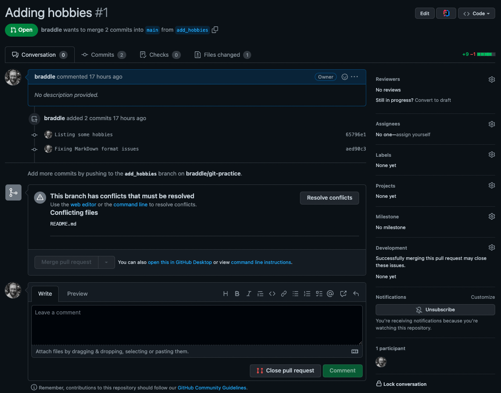

We now need to resolve the conflicts, so we can merge our pull request. First move back to the `add_hobbies` branch. We
have two options for this we can specify the branch we want to switch to

```shell
git checkout add_hobbies
```

or use a `-` to go back to the previously checked out branch

```shell
git checkout -
```

We are now ready to rebase this branch against the origin/main branch

```shell
git rebase
```

Running the rebase command should produce output like this show that have a conflict in the merge of changes to the 
README must be manually resolved

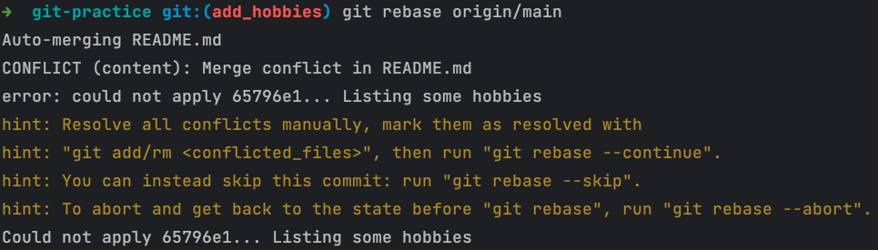

We can check the status, it shows us that both branches have changed the README file and that we have a number of 
options how to deal with it. 


We are going to fix the conflicts in the file. When you are looking at file it show the conflict between `<<<<<<<`, 
`========` or `>>>>>>>`

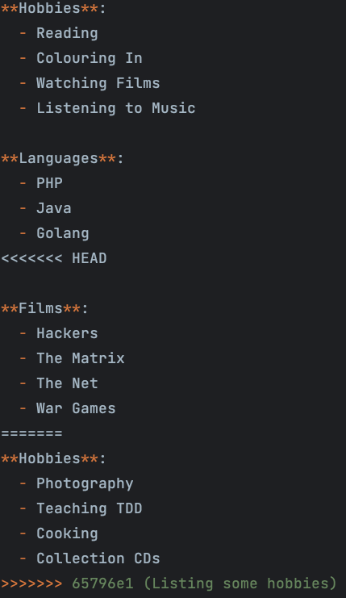

We are going to fix the conflicts but moving the hobbies we added to the list of hobbies that have been added on the 
`main` branch.


Once we have resolved the conflict we use `git add` in the same way we would if we were working on files during our 
normal workflow but rather than commiting we run the `git rebase` command with the continue flag `--continue` this tells
git to move on to attemping to merge the next commit.

```shell
git add README.md
git rebase --continue
```

We have one more conflict to resolve at this point. We do this in the same way we handled the previous conflict 

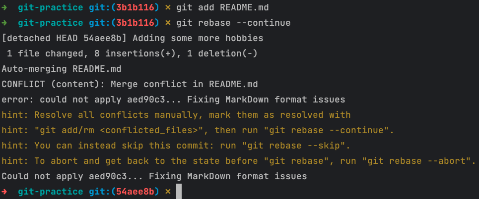


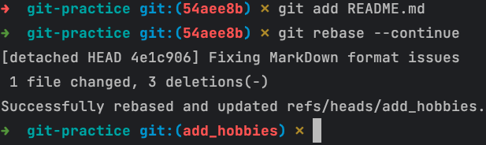

We have now completed the rebase process. We now need to push the changes commits up to GitHub.

You will notice that the first time i run `git push` it fails. This is because when i rebased the branch the commit 
hashes would have changed becuase i have effectively changed history by rebasing. To acknowledge this by using the force
flag `-f`.

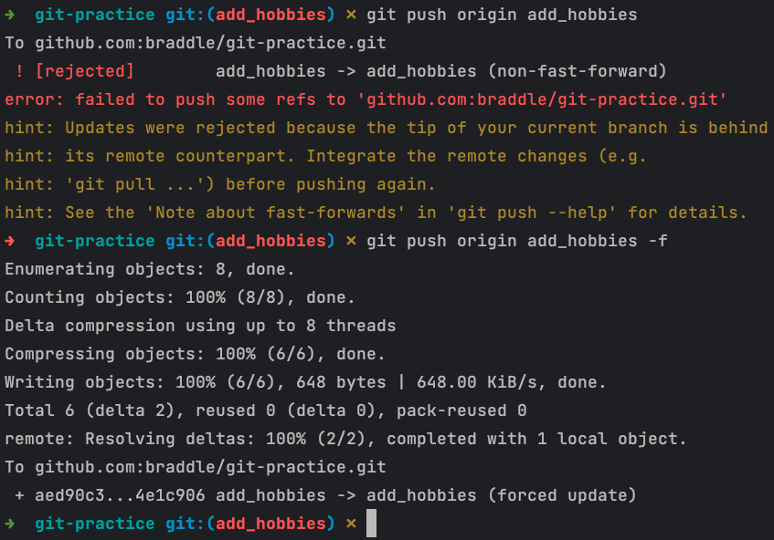

The Pull Request is now merge-able again.


Now merge the Pull Request and delete the branch

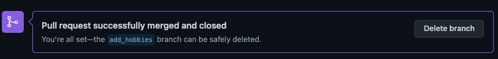

### Deleting Commits

Sometimes we commit things we shouldn't. Passwords and other secrets can accidentally get committed.

create a new file `secrets.md` and add some secret content. 

```markdown
**email_passord**: SUPER_SECRET
**database_password**: P@55w0Rd!
**api_key**: A_REALLY_LONG_STRING_OR_LETTERS_AND_1234567890
```

Add and commit the changes

```shell
git add .
git commit -m "Accidentally committing some secrets"
```

By checking the log you can see a list of the commit. here are the last 3. We want to remove the last commit we made. To
do this we can use the `reset` command.

There are two ways you can remove commits. The first uses the soft flag `--soft` the removes to the commit but returns 
the changes to the unstaged area so you can edit the file and recommit the changes. The other way to remove the commit 
is to use the hard flag `--hard` this deleted the commit, but does not bring back the changes.

```shell
git reset HEAD~1 --hard
git reset HEAD~1 --soft
```

If you remove the commit using the soft flag we can look at a method to ensure we don't commit files that should not be 
in the repository.


