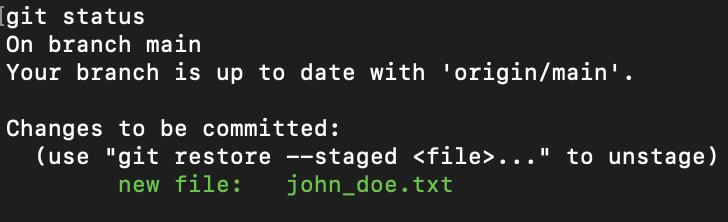

# Version Control - Simple Operations

## Overview

This is a short exercise to get you used to using Git to perform simple operation such as: cloning, staging, commiting and pushing.

## Setup

- Have Git installed on your machine
- Ensure the instructor has added your GitHub account added as a collaborator to the repository [here](https://github.com/armakuni/version-control-exercise)
- Create a PAT token: [creating a personal access token](https://docs.github.com/en/authentication/keeping-your-account-and-data-secure/creating-a-personal-access-token)

## Steps

1. The first step is to clone the repository. We can achieve this using the `git clone` command followed by the URL of the repo.

   git clone https://github.com/jakepeters199/bn-osf-vcs.git

_Note: Git will ask for your GitHub username and password. When Git prompts you for your password, enter your personal access token (PAT) instead._

You will now have a local copy of the repository.

2. Navigate into the directory `cd version-control-exercise` and run `git status`. You will see that your working directory is clean as you haven't modified or added any files.

   

3. Create a text file named in the 'firstname_surname.txt' format and fill it with content of your choice. Save your changes.

4. Now re-run the `git status` command. You will see that you now have a new untracked file.

   

5. To track this file, issue the command `git add john_doe.txt` replacing the filename as appropriate.

   This will tell Git to start tracking the file and add it to the staging area, ready for us to commit.

6. Now re-run the `git status` command again. You will now see that you now have a new tracked file ready to be commited.

   

7. We now need to create a commit containing this change. To do this issue `git commit -m 'Added text file containing my amazing content'`.

   

   Your changes have now been commited.

8. We are now ready to upload your local repository content to a remote repository. To do this we use the `git push` command. This will upload all commits that you have to the remote repository.

   

_Note: If somebody has updated the repository since you have cloned it, you will need to issue the `git pull` command to bring your repository up to date._

Congratulations, you have successfully pushed changes to a repository.
